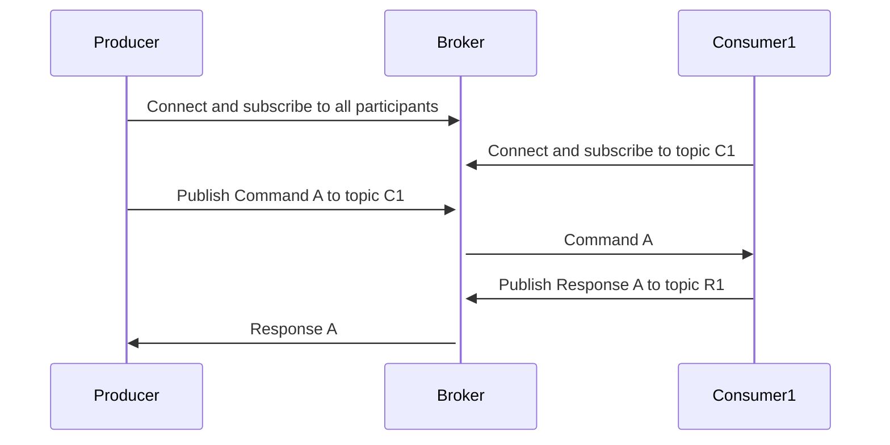

# twinkly-haha
OpenC2 messages using MQTT Transfer Specification

Unlike HTTP where Producer connects directly to consumer:
```mermaid
sequenceDiagram
    Producer->>Consumer: Command A
    Consumer->>-Producer: Response A
```

MQTT requires a topic overlay to support request-response


