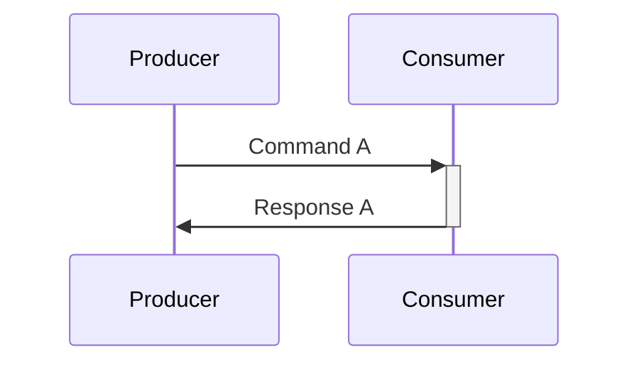
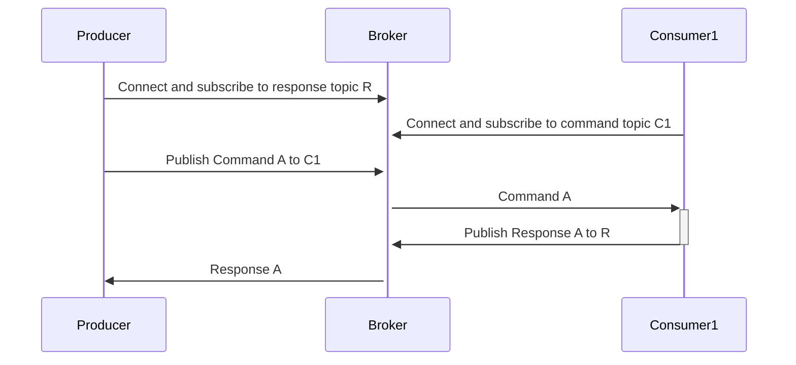

# Twinkly-haha
OpenC2 messages using MQTT Transfer Specification

## HTTP
Using HTTP Producer connects directly to a single Consumer:

# MQTT
MQTT requires a topic overlay to support request-response, for a single or multiple Consumers:

